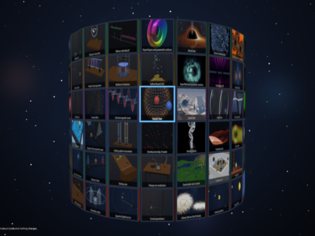
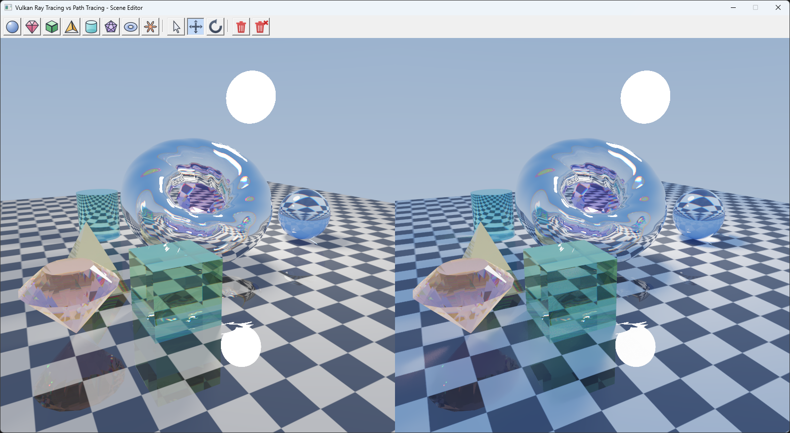
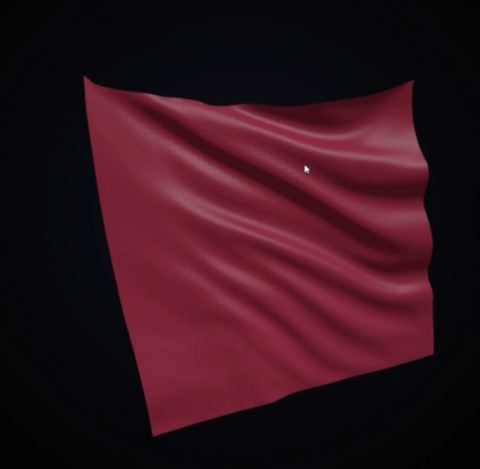
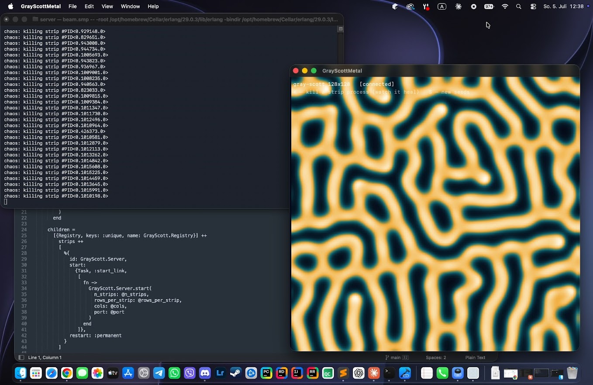
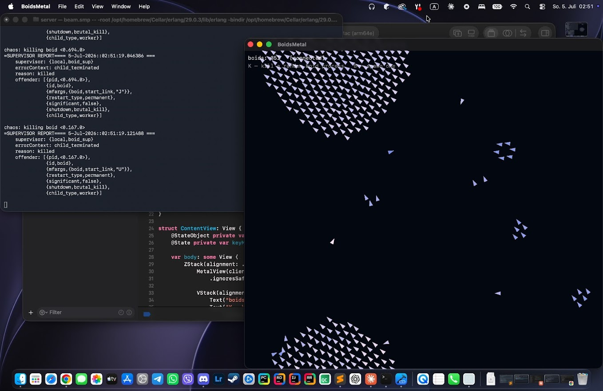
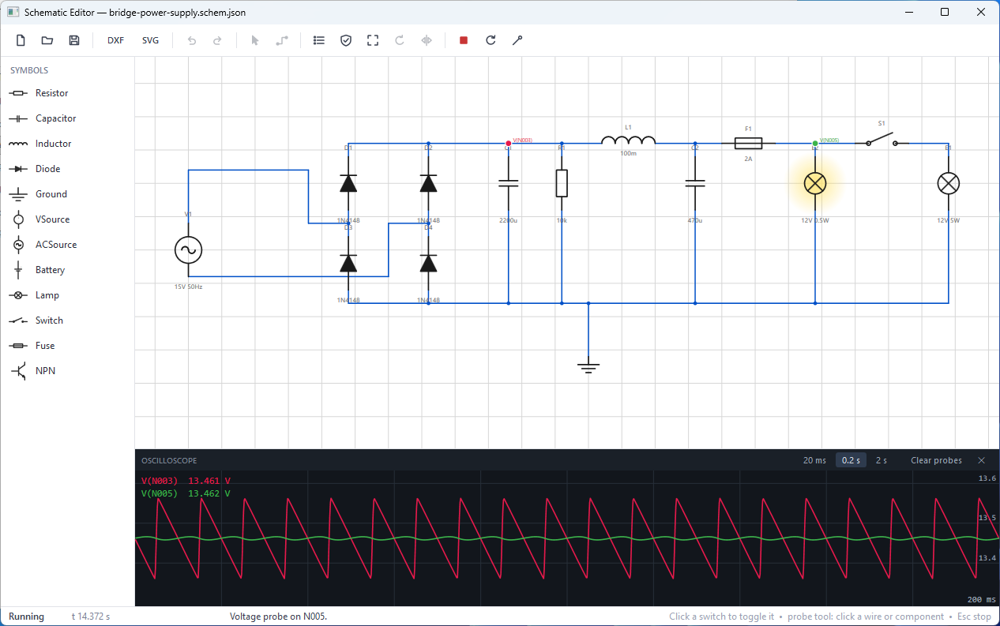

# Mykhailo Makarov (Michael Makarov)

**Senior .NET / C# Software Engineer. Munich, Germany.**
Enterprise backend, desktop applications, legacy modernization, and GPU physics simulation.

20 years of professional software development. I write production line-of-business systems in C# and .NET, and I have been writing real-time physics simulations on the GPU since 2004, first in Delphi and OpenGL, now in Vulkan, DirectX 12, Metal, and CUDA.

Open to remote positions across Germany and the EU, or hybrid in Munich.

---

## About me

I started with physics. I have a university degree in physics, and my first serious program was a simulation suite written in Delphi 7 with OpenGL in 2004: rigid bodies, springs, fields, particle systems. That project never really ended. Twenty years later it has become the Makarov Physics Suite, roughly 120+ GPU simulation modules covering classical mechanics, fluids, electromagnetism, optics, thermodynamics, and quantum systems, with more than 300 automated numerical verifications against analytical solutions.

Professionally I spent those two decades in enterprise software. ASP.NET Core services, MS SQL and Entity Framework data layers, WPF and WinForms desktop clients, and a long specialization in legacy modernization: taking Delphi and old .NET Framework systems that a business still depends on and moving them forward without breaking the business.

I moved from Ukraine to Germany in 2022 and have been based in Munich since. Before that I worked in Kyiv, and earlier in Kherson and Crimea/Simferopol.

I write my simulation projects under a strict rule: zero external dependencies. No engines, no physics libraries, no math frameworks. Every solver, every integrator, every renderer is written from scratch. It is slower to build and it teaches you far 

Full professional history: [linkedin.com/in/makarov-mm](https://www.linkedin.com/in/makarov-mm)

---

## What I do

**Enterprise backend**
C#, .NET / .NET Core, ASP.NET Core, REST APIs, Entity Framework Core, MS SQL Server, PostgreSQL, background services, integrations, domain modeling, unit and integration testing.

**Desktop applications**
WPF with MVVM, WinForms, custom controls, data-heavy UI, hardware-accelerated rendering embedded in business applications.

**Legacy modernization**
Delphi to .NET migration, .NET Framework to .NET Core, strangler-fig refactoring of monoliths, replacing undocumented systems while keeping them running in production.

**Graphics and GPU compute**
Vulkan, DirectX 12, OpenGL, Metal, CUDA, compute shaders, hardware ray tracing, GPU particle systems, real-time numerical integration, render pipeline architecture.

**Numerical simulation**
Fluid dynamics, N-body gravitation, rigid body dynamics, finite difference and spectral methods, reaction-diffusion systems, wave equations, Schrodinger evolution, verification against analytical solutions.

---

## Selected projects

### Makarov Physics Suite
The main project. Makarov Physics Suite is a collection of more than 120 interactive physics simulation modules written primarily in C# and C++, with extensive use of GPU computing for real-time numerical simulation and visualization.

The suite covers a broad range of physics, including classical mechanics, rigid-body dynamics, gravitation, oscillations and waves, fluid dynamics, electromagnetism, optics, thermodynamics, statistical physics, relativity, and quantum mechanics.

The emphasis is on interactive simulation rather than predefined animations: parameters can be changed at runtime, systems can be perturbed and explored, and the resulting physical behavior is calculated numerically in real time. Different modules employ techniques such as numerical integration of differential equations, particle systems, N-body methods, SPH fluid simulation, charged-particle dynamics, ray tracing, path tracing, and GPU-accelerated computation.

Correctness is an important part of the project. The codebase contains more than 300 automated verification tests that compare numerical simulation results against analytical solutions, conservation laws, reference values, and other known physical results.

The project has its roots in an earlier physics program I started developing while at university more than 20 years ago. The current version is effectively a complete reimplementation and a compilation of ideas, experiments, algorithms, and simulation work accumulated over many years.

Makarov Physics Suite is published on Steam (App ID 4861360): https://store.steampowered.com/app/4861360/Makarov_Physics_Suite/

---

### Vulkan Ray Tracing Scene Editor
Interactive scene editor using hardware-accelerated ray tracing through the Vulkan RT extensions.

https://github.com/makarov-mm/vulkan-rt-vs-pt-editor

---

### TurbulenceLab
Real-time fluid simulation around a NACA 0012 airfoil, written in Swift and Metal for macOS. Vorticity visualization, adjustable angle of attack and Reynolds number.

https://github.com/makarov-mm/turbulence-lab

---

### Cloth Simulation
Mass-spring cloth solver implemented twice, once in C# with OpenGL and once in Swift with Metal, for direct comparison of the two stacks.

https://github.com/makarov-mm/cloth-simulation

---

### Gray-Scott Reaction-Diffusion
Reaction-diffusion pattern generation implemented in Elixir and in Swift, exploring functional and GPU approaches to the same PDE.

https://github.com/makarov-mm/gray-scott-elixir

---

### Boids
Flocking simulation implemented in Erlang, C++, and Swift with Metal. Three languages, three concurrency models, one algorithm.

https://github.com/makarov-mm/boids-metal-erlang

---

### Quantum Wave Simulator
Time-dependent Schrodinger equation solver with Metal compute shaders. Tunneling, wave packet dispersion, potential wells.

---

### Schematic Editor with AC Simulation
Circuit schematic editor with nodal analysis and AC simulation, built in C# with WPF and again in Swift.

https://github.com/makarov-mm/schematic-editor

---

### Delphi Physics Suite
The original 2004 codebase, preserved and gradually modernized from Delphi 7.

https://github.com/makarov-mm/MakarovPhysics

---

## Technologies

**Languages**
C#, C++, Delphi / Object Pascal, Swift, SQL, GLSL, HLSL, MSL, Python, Elixir, Erlang

**.NET**
.NET 8, .NET Core, .NET Framework, ASP.NET Core, Entity Framework Core, WPF, WinForms, MVVM, xUnit, NUnit

**Graphics and compute**
Vulkan, DirectX 12, OpenGL, Metal, CUDA, compute shaders, hardware ray tracing

**Data**
MS SQL Server, PostgreSQL, SQLite, T-SQL, query optimization

**Tooling**
Git, Docker, Azure DevOps, GitHub Actions, RenderDoc, Nsight, Visual Studio, Rider, Xcode

---

## Languages

Russian and Ukrainian: native. English: professional working proficiency. German: intermediate, improving.

---

## Contact

- GitHub: [github.com/makarov-mm](https://github.com/makarov-mm)
- LinkedIn: [linkedin.com/in/makarov-mm](https://www.linkedin.com/in/makarov-mm)
- Threads: [threads.com/@m.m.makarov](https://www.threads.com/@m.m.makarov)
- Twitter: [x.com/makarov_bayern](https://x.com/makarov_bayern)
- YouTube: [youtube.com/@makarov.m.m](https://www.youtube.com/@makarov.m.m)
- Instagram: [instagram.com/m.m.makarov](https://www.instagram.com/m.m.makarov)
- Reddit: [reddit.com/user/mischa_bayern/](https://www.reddit.com/user/mischa_bayern/)
- Buy me a coffee: [buymeacoffee.com/makarovmm](https://buymeacoffee.com/makarovmm)
- Qiita: [qiita.com/makarov-mm](https://qiita.com/makarov-mm)
- Zenn: [zenn.dev/makarov](https://zenn.dev/makarov)
- Linktr: [linktr.ee/makarovmm](http://linktr.ee/makarovmm)
- Rutube: [rutube.ru/channel/1319322/](https://rutube.ru/channel/1319322/)
- Vkontakte: [vk.ru/misha_bayern](https://vk.ru/misha_bayern)
- Pikabu: [pikabu.ru/@KevlarBeaver](https://pikabu.ru/@KevlarBeaver)
- Steam: [Makarov_Physics_Suite](https://store.steampowered.com/app/4861360/Makarov_Physics_Suite)
- Location: Munich, Bavaria, Germany
- Availability: open to remote roles in Germany and the EU, or hybrid in Munich

---

Keywords: Mykhailo Makarov, Michael Makarov, Makarov, senior .NET developer Munich, C# developer Germany, ASP.NET Core engineer, WPF developer, Delphi modernization, legacy migration specialist, Vulkan developer, DirectX 12, Metal, CUDA, GPU compute, physics simulation, computational physics, fluid dynamics simulation, real-time rendering, graphics programmer, remote .NET developer Europe.
