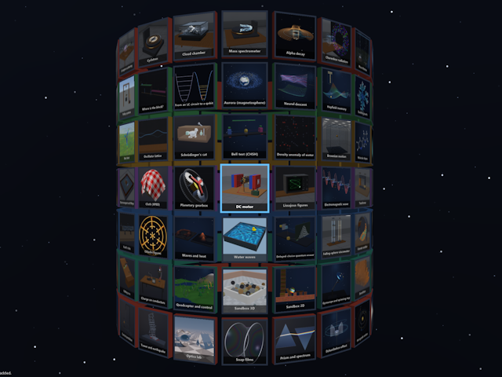
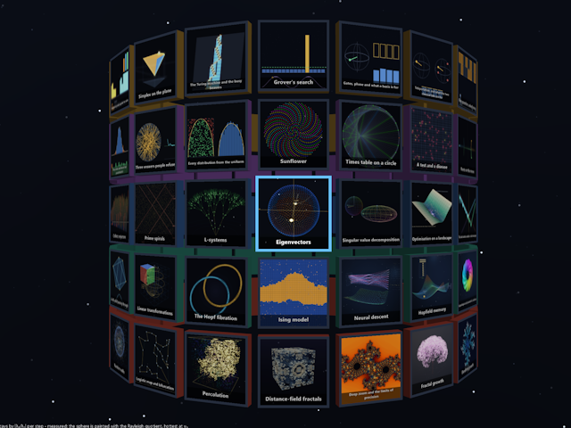
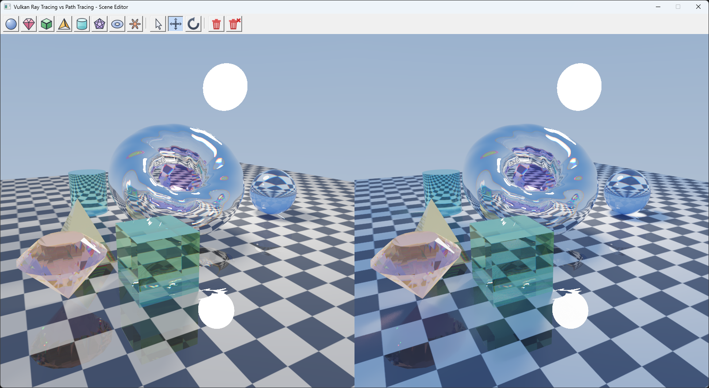
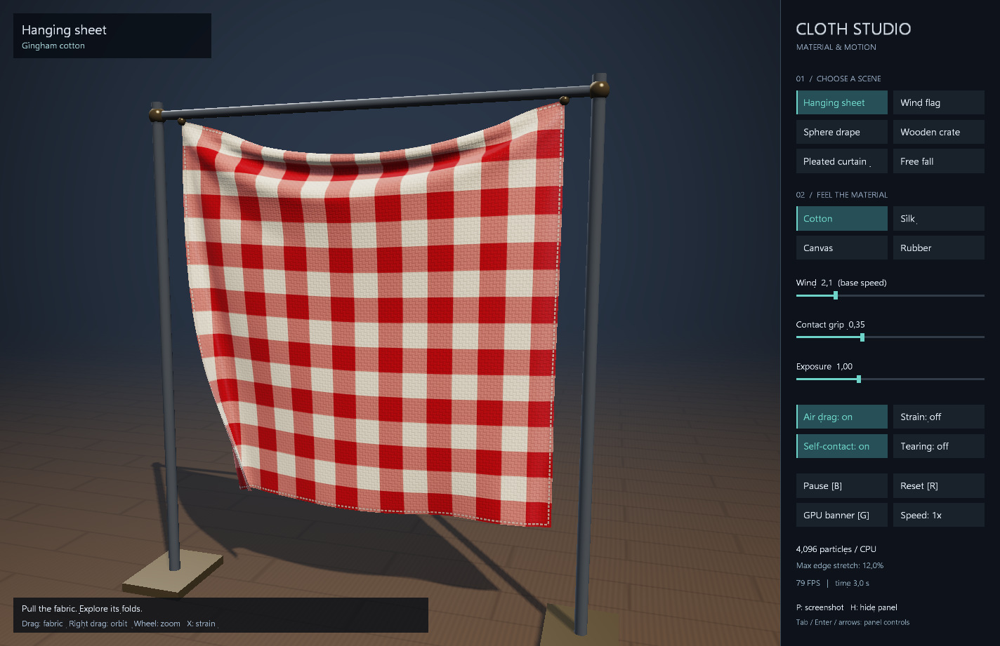
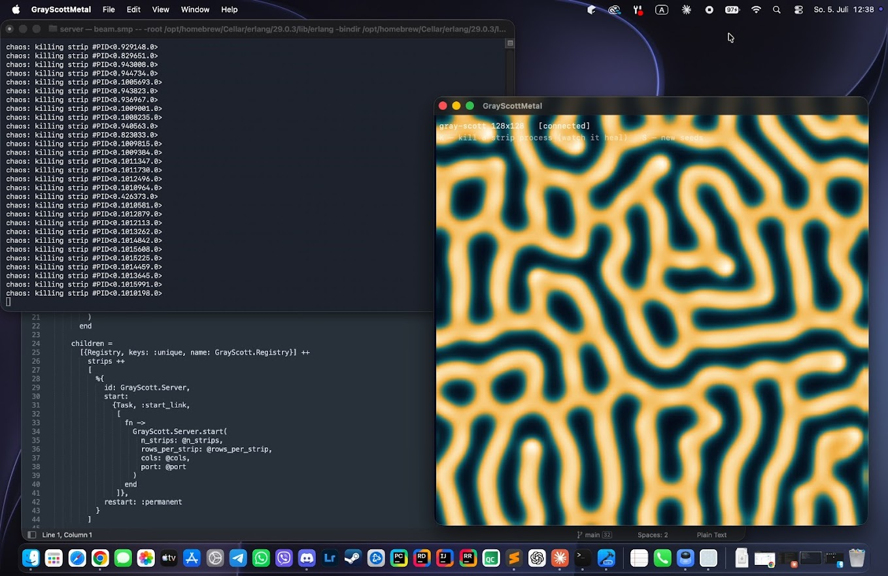
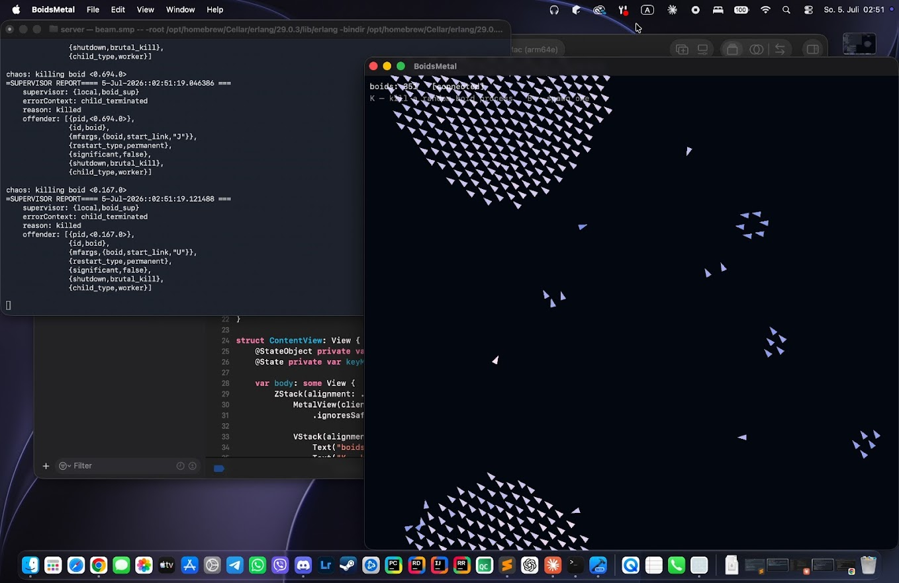
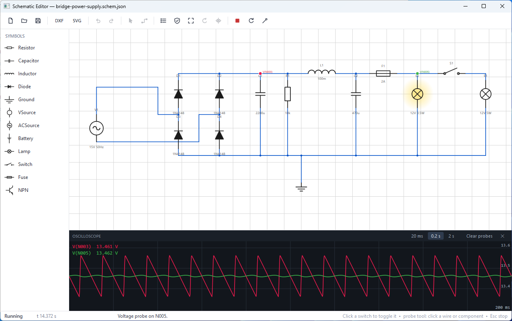

# Mykhailo Makarov (Michael Makarov)

**Senior .NET / C# Software Engineer. Munich, Germany.**
Enterprise backend, desktop applications, legacy modernization, and GPU physics simulation.

20 years of professional software development. I write production line-of-business systems in C# and .NET, and I have been writing real-time physics simulations on the GPU since 2004, first in Delphi and OpenGL, now in Vulkan, DirectX 12, Metal, and CUDA.

Open to remote positions across Germany and the EU, or hybrid in Munich.

---

## About me

I build software from the underlying algorithms to the finished product. Nearly 20 years of professional development have taken me through enterprise systems, legacy modernization, physics, graphics and infrastructure.

Enterprise development is my professional foundation: C#, .NET/.NET Core, ASP.NET Core, REST APIs, EF Core, LINQ, WPF/MVVM and WinForms. I work with MS SQL Server, T-SQL, database design, query tuning and integrations, alongside PostgreSQL and MySQL. My stack also includes Blazor Server/WebAssembly and Razor components, unit testing, CI/CD, Docker and Azure.

I modernize systems that businesses still rely on: Delphi/Object Pascal with InterBase, Firebird and ADO; .NET Framework, WinForms, WebForms and ASP.NET MVC. The work means understanding undocumented behavior, untangling business logic and data access, improving SQL performance, and moving components to modern .NET without disrupting daily operations.

Physics and computer graphics are a long-running personal pursuit. I build 2D/3D visualizations, renderers, ray/path tracers and physics engines from first principles: rigid bodies, fluids, particles, fields and numerical solvers. I use C#, C++, Rust and Swift with OpenGL, Vulkan, DirectX 12, Metal, CUDA/OpenCL and shaders; GDI+/Direct2D for 2D graphics, Python for numerical verification, and Erlang/Elixir for concurrent simulation experiments. I independently developed and released Makarov Physics Suite on Steam.

I have built and administered my own Linux servers, configured Apache and deployed backend services. My infrastructure experience also includes Windows Server, IIS, Bash, PowerShell, Git and automated delivery. I use Node.js/JavaScript and Python for backend development, scripting and tooling, with experience in Java, Spring and Hibernate.

On the frontend, I work with Angular, TypeScript, JavaScript, HTML5, CSS, Sass/SCSS, Less and jQuery, from business interfaces and dynamic forms to interactive WebGL visualizations. At Artisteer, I worked on WYSIWYG editing, graphics and HTML/CSS generation for CMS themes.

My AI work includes Python/LLM prototypes at PACS to evaluate integration into existing business systems, and a convolutional neural network implemented from scratch in Rust. I also use AI tools in development, with code review, tests and numerical checks guiding what I ship.

Based in Munich; open to local or remote roles that value technical ownership, curiosity and depth.
[linkedin.com/in/makarov-mm](https://www.linkedin.com/in/makarov-mm)

---

Ich entwickle Software vom Algorithmus bis zum fertigen Produkt. Meine Erfahrung aus fast 20 Jahren Softwareentwicklung umfasst Enterprise-Systeme, Legacy-Modernisierung, Physik, Computergrafik und Infrastruktur.

Mein beruflicher Schwerpunkt ist die Enterprise-Entwicklung: C#, .NET/.NET Core, ASP.NET Core, REST-APIs, EF Core, LINQ, WPF/MVVM und WinForms. Dazu gehören MS SQL Server, T-SQL, Datenbankdesign, Abfrageoptimierung und Schnittstellen sowie PostgreSQL und MySQL. Mein Werkzeugkasten umfasst auch Blazor Server/WebAssembly, Razor-Komponenten, Unit-Tests, CI/CD, Docker und Azure.

Ich modernisiere gewachsene Systeme: Delphi/Object Pascal mit InterBase, Firebird und ADO sowie .NET Framework, WinForms, WebForms und ASP.NET MVC. Dabei erschließe ich undokumentiertes Verhalten, entflechte Geschäftslogik und Datenzugriffe, optimiere SQL und überführe Komponenten schrittweise in modernes .NET, während der laufende Betrieb erhalten bleibt.

Physik und Computergrafik begleiten mich seit vielen Jahren. Ich entwickle eigene 2D-/3D-Visualisierungen, Renderer, Ray-/Pathtracer und Physik-Engines: Starrkörper, Fluide, Partikel, Felder und numerische Solver. Dafür nutze ich C#, C++, Rust und Swift mit OpenGL, Vulkan, DirectX 12, Metal, CUDA/OpenCL und Shadern; GDI+/Direct2D für 2D-Grafik, Python zur numerischen Verifikation und Erlang/Elixir für nebenläufige Simulationsexperimente. Die Makarov Physics Suite habe ich eigenständig entwickelt und auf Steam veröffentlicht.

Ich habe eigene Linux-Server aufgebaut und administriert, Apache konfiguriert und Backend-Dienste bereitgestellt. Hinzu kommen Windows Server, IIS, Bash, PowerShell, Git und automatisierte Deployment-Prozesse. Node.js/JavaScript und Python nutze ich für Backends, Skripte und Werkzeuge; Erfahrung habe ich auch mit Java, Spring und Hibernate.

Im Frontend arbeite ich mit Angular, TypeScript, JavaScript, HTML5, CSS, Sass/SCSS, Less und jQuery: von Geschäftsanwendungen bis zu interaktiven WebGL-Visualisierungen. Bei Artisteer arbeitete ich an WYSIWYG-Funktionen, Grafik und der HTML/CSS-Ausgabe für CMS-Themes.

Meine KI-Arbeit umfasst Python-/LLM-Prototypen zur Prüfung einer Integration in bestehende Systeme sowie ein selbst implementiertes Convolutional Neural Network in Rust. Ich nutze KI-Werkzeuge auch in der Entwicklung und prüfe die Ergebnisse mit Code-Reviews, Tests und numerischen Vergleichen.

Ich lebe in München und suche Aufgaben vor Ort oder remote, mit technischer Verantwortung, Gestaltungsspielraum und fachlicher Tiefe.
[linkedin.com/in/makarov-mm](https://www.linkedin.com/in/makarov-mm)

---

## What I do

**Enterprise backend**
C#, .NET / .NET Core, ASP.NET Core, REST APIs, Entity Framework Core, MS SQL Server, PostgreSQL, background services, integrations, domain modeling, unit and integration testing.

**Desktop applications**
WPF with MVVM, WinForms, custom controls, data-heavy UI, hardware-accelerated rendering embedded in business applications.

**Legacy modernization**
Delphi to .NET migration, .NET Framework to .NET Core, strangler-fig refactoring of monoliths, replacing undocumented systems while keeping them running in production.

**Graphics and GPU compute**
Vulkan, DirectX 12, OpenGL, Metal, CUDA, compute shaders, hardware ray tracing, GPU particle systems, real-time numerical integration, render pipeline architecture.

**Numerical simulation**
Fluid dynamics, N-body gravitation, rigid body dynamics, finite difference and spectral methods, reaction-diffusion systems, wave equations, Schrodinger evolution, verification against analytical solutions.

---

## Selected projects

### Makarov Physics Suite
The main project. Makarov Physics Suite is a collection of 140 interactive physics simulation modules, written in C# on .NET with a custom OpenGL 3.3 renderer and native CUDA, OpenCL and Vulkan compute backends. Released on Steam on 26 August 2026 and updated in patches since.

The carousel is seven rings of twenty modules: gravity, orbits and oscillations; mechanics, machines and bodies; fluids, waves and sound; electricity, magnetism and fields; quantum, heat and statistics; complexity, chaos and growth; atomic and nuclear physics. Among them: a Barnes-Hut galaxy of 30 000 bodies, a black hole ray tracer, a Vulkan hardware path tracer as an optics lab, lattice-Boltzmann and SPH fluids, a granular tumbler and an MPM avalanche, a stirred superfluid that sheds quantised vortices, a tokamak, a cloud chamber, a Bell test, and a rigid-body sandbox with destruction.

The emphasis is on interactive simulation rather than predefined animations: parameters can be changed at runtime, systems can be perturbed and explored, and the resulting physical behavior is calculated numerically in real time. The methods behind the modules include symplectic and Runge-Kutta integration, split-step spectral solvers for the Schrödinger and Gross-Pitaevskii equations, FDTD electromagnetics, lattice Boltzmann, SPH and MLS-MPM continuum methods, a rigid-body solver with joints and fracture, Barnes-Hut N-body, path tracing, and GPU acceleration through twenty CUDA kernels with OpenCL and Vulkan counterparts and a silent CPU fallback.

Correctness is the core of the project. Every model is written twice: first as a Python reference implementation with pinned values, then as the C# model, and the self-test compares the two along with analytical solutions, conservation laws and reference data. The suite currently runs more than 24 000 such checks, with the GPU paths graded against the CPU solvers on conserved quantities. A gate of 61 static checkers runs before every release, covering everything from localization coverage to shader constants shared between GLSL and Metal.

The application ships in 23 languages and is built with zero external dependencies: no engine, no physics or math library, no NuGet packages. A macOS port in Swift and Metal runs in parallel, with 75 of the 140 modules ported so far.

Makarov Physics Suite is published on Steam (App ID 4861360): https://store.steampowered.com/app/4861360/Makarov_Physics_Suite/

And Microsoft Store:  https://apps.microsoft.com/detail/9P23373JLGVF

---

### Makarov Math Suite
Second product built on the same codebase as the Physics Suite: 95 modules today, on the way to a full catalogue of 140.

The three suites share one source tree, one renderer, and one module framework. A product manifest decides what goes into each build: which executable, which modules, which carousel layout, which shell strings and locales. Shared code never references a product; a dedicated checker enforces that rule at build time, and the release folder of the Physics Suite was verified file for file and hash for hash before and after the split.

The Math Suite is organized in rings of twenty, four of them complete and a fifth in progress:

- Fractals, growth and chaos: Mandelbrot and Julia deep zoom to the limits of precision, fractal and dendritic growth, reaction-diffusion, chaos and strange attractors, the logistic map with its bifurcation diagram, percolation, the Galton board, the birth of the giant component.
- Form, transformation and analysis: Riemann surfaces and complex mappings, 4D polytopes and the Hopf fibration, minimal surfaces, hyperbolic geometry, knots, conic sections, linear transformations, the Ising model and Hopfield memory.
- Chance, structure and search: eigenvectors and the SVD, optimisation on a landscape, the derivative, the integral and Taylor polynomials as objects, Fourier series, Monte Carlo, Voronoi and Delaunay, graph theory and the travelling salesman, Collatz, prime spirals, L-systems.
- Symmetry, probability and the applied: Bayes and the base-rate fallacy, the central limit theorem, confidence intervals and p-values, Newton basins, PageRank, the cusp catastrophe, map projections, curvature and parallel transport, quaternions and gimbal lock, the primes from the zeros of zeta, wallpaper groups and Penrose tilings.
- Numbers, algorithms and games: a quantum computing series (gates, Grover's search, teleportation, Deutsch-Jozsa, the quantum Fourier transform and Shor's period finding, error-correcting codes), Euclid's algorithm and continued fractions, the sieve, RSA on small numbers, hashes and collisions, sorting races, breadth-first and depth-first search, Dijkstra, and Nim.

Every card is built around one gesture and one number that is computed exactly and then computed by counting, and the two are held together in the self-test. Modules that make sense in both products are compiled into both from a single implementation. The verification approach is the same as in the Physics Suite: every model has a Python reference implementation written first, and the C# tests are pinned to numbers that are bit-exact between the two. For the math modules that means exact anchors, not tolerances: the period-doubling points of the logistic map at 3 and 1+√6, the Feigenbaum constant from the superstable ladder, Kesten's self-duality of bond percolation on the square lattice, the Fatou-Julia dichotomy for Julia sets, Bouton's rule for Nim checked against the fully solved game tree on 7776 positions.

Makarov Math Suite is published on Steam (App ID 5204230):  https://store.steampowered.com/app/5204230/Makarov_Math_Suite/

And Microsoft Store:  https://apps.microsoft.com/detail/9P5K9QRHHKKP

---

### Makarov Astronomy Suite
Third product on the same codebase. In development: a catalogue of 41 cards, 24 of them written.

Positioned as a measurement laboratory rather than a planetarium or a sandbox: the point is to set up an experiment, change a parameter, and read the result off the screen. Three groups:

- Gravity and celestial mechanics: Kepler orbits, N-body systems, planetary motion and retrograde loops, galaxy dynamics, gravitational waves.
- Light, spectra, and instruments: blackbody radiation, Rømer's measurement of the speed of light, the hydrogen spectrum, prisms and ray optics, the optics bench.
- Extreme objects and plasma: black holes, aurora, tokamak plasma, radioactive decay, Cherenkov radiation, muon lifetime.

The astronomy-specific engineering problems are floating-point precision at astronomical scales, symplectic integrators that keep orbits stable over long simulated times, and verification of ephemerides against JPL Horizons. The hardware ray tracer written for the optics modules is reused for black hole ray tracing and gravitational lensing.

---

### Vulkan Ray Tracing Scene Editor
Interactive scene editor using hardware-accelerated ray tracing through the Vulkan RT extensions.

https://github.com/makarov-mm/vulkan-rt-vs-pt-editor

---

### TurbulenceLab
Real-time fluid simulation around a NACA 0012 airfoil, written in Swift and Metal for macOS. Vorticity visualization, adjustable angle of attack and Reynolds number.

https://github.com/makarov-mm/turbulence-lab

---

### Cloth Simulation
Mass-spring cloth solver implemented twice, once in C# with OpenGL and once in Swift with Metal, for direct comparison of the two stacks.

https://github.com/makarov-mm/cloth-simulation

---

### Gray-Scott Reaction-Diffusion
Reaction-diffusion pattern generation implemented in Elixir and in Swift, exploring functional and GPU approaches to the same PDE.

https://github.com/makarov-mm/gray-scott-elixir

---

### Boids
Flocking simulation implemented in Erlang, C++, and Swift with Metal. Three languages, three concurrency models, one algorithm.

https://github.com/makarov-mm/boids-metal-erlang

---

### Quantum Wave Simulator
Time-dependent Schrodinger equation solver with Metal compute shaders. Tunneling, wave packet dispersion, potential wells.

---

### Schematic Editor with AC Simulation
Circuit schematic editor with nodal analysis and AC simulation, built in C# with WPF and again in Swift.

https://github.com/makarov-mm/schematic-editor

---

### Delphi Physics Suite
The original 2004 codebase, preserved and gradually modernized from Delphi 7.

https://github.com/makarov-mm/MakarovPhysics

---

## Technologies

**Languages**
C#, C, C++, Delphi / Object Pascal, Swift, Rust, SQL, GLSL, HLSL, MSL, Python, Elixir, Erlang, JavaScript, TypeScript

**.NET**
.NET, .NET Core, .NET Framework, ASP.NET Core, Entity Framework Core, WPF, WinForms, MVVM, xUnit, NUnit

**Graphics and compute**
Vulkan, DirectX 12, OpenGL, Metal, CUDA, compute shaders, hardware ray tracing

**Data**
MS SQL Server, PostgreSQL, SQLite, T-SQL, query optimization

**Tooling**
Git, Docker, Azure DevOps, GitHub Actions, RenderDoc, Nsight, Visual Studio, Rider, Xcode

---

## Languages

Russian and Ukrainian: native. English: professional working proficiency. German: intermediate, improving.

---

## Contact

- GitHub: [github.com/makarov-mm](https://github.com/makarov-mm)
- LinkedIn: [linkedin.com/in/makarov-mm](https://www.linkedin.com/in/makarov-mm)
- Threads: [threads.com/@m.m.makarov](https://www.threads.com/@m.m.makarov)
- Twitter: [x.com/makarov_bayern](https://x.com/makarov_bayern)
- YouTube: [youtube.com/@makarov.m.m](https://www.youtube.com/@makarov.m.m)
- Instagram: [instagram.com/m.m.makarov](https://www.instagram.com/m.m.makarov)
- Tech Instagram: [instagram.com/makarov.dev](https://www.instagram.com/makarov.dev)
- Gaming Instagram: [instagram.com/makarov.gamer](https://www.instagram.com/makarov.gamer)
- Reddit: [reddit.com/user/mischa_bayern/](https://www.reddit.com/user/mischa_bayern/)
- Buy me a coffee: [buymeacoffee.com/makarovmm](https://buymeacoffee.com/makarovmm)
- Qiita: [qiita.com/makarov-mm](https://qiita.com/makarov-mm)
- Zenn: [zenn.dev/makarov](https://zenn.dev/makarov)
- Linktr: [linktr.ee/makarovmm](http://linktr.ee/makarovmm)
- Makarov Physics: [makarovphysics.com](https://makarovphysics.com/)
- Steam: [Makarov_Physics_Suite](https://store.steampowered.com/app/4861360/Makarov_Physics_Suite/), [Makarov_Math_Suite](https://store.steampowered.com/app/5204230/Makarov_Math_Suite/)
- Microsoft Store: [Makarov_Physics_Suite](https://apps.microsoft.com/detail/9P23373JLGVF), [Makarov_Math_Suite](https://apps.microsoft.com/detail/9P5K9QRHHKKP)
- Location: Munich, Bavaria, Germany
- Availability: open to remote roles in Germany and the EU, or hybrid in Munich

---

## Qiitaで書いている記事

- [Makarov Physics Suite — 動画32本の紹介](https://qiita.com/makarov-mm/items/4ee20a3bfcfbd3942ab4)
- [Makarov Astronomy Suite：私の天文学プログラム集](https://qiita.com/makarov-mm/items/9c106cdc365aeb1d3810)
- [ブラックホールはどう描かれる？光線追跡で作る Schwarzschild Black Hole](https://qiita.com/makarov-mm/items/71552a35310f89f7a603)
- [オーロラはどう生まれる？地球磁場中の荷電粒子をシミュレーションする Aurora モジュール](https://qiita.com/makarov-mm/items/eaec22e0b40d6bce8492)
- [振り子は本当に単純なのか？6種類の振り子をシミュレーションしてみた](https://qiita.com/makarov-mm/items/342e87a4ff3dcb25f64d)
- [Visual Basic 6 で乱流は計算できるのか？NACA 0012 翼まわりの 2D Navier–Stokes ソルバー](https://qiita.com/makarov-mm/items/2c2afc27ef40d3edf045)
- [個人開発で物理シミュレーション集を作りました（126モジュール・GPU計算対応）](https://qiita.com/makarov-mm/items/2a3ccf61918e33b97ccb)
- [物理プログラム集 — 120以上のインタラクティブ物理実験](https://qiita.com/makarov-mm/items/d91f2397242d1456fe50)
- [macOS版 Makarov Physics Suite](https://qiita.com/makarov-mm/items/1399804b8310a9d31e8b)
- [2476個のレンガの城を鉄球で壊す — 剛体ソルバに「崩れ方」を一切教えずに](https://qiita.com/makarov-mm/items/e7b4fe651f4031af8eea)
- [粉体ドラム（Granular tumbler）](https://qiita.com/makarov-mm/items/5315779b0999af0ba84c)
- [目で見る数学 ― 物理シミュレータから分かれたプロジェクト](https://qiita.com/makarov-mm/items/32a7b309444012f8f806)
- [数学は「見る」ことができるのか？自作の数学シミュレーション集 Makarov Math Suite を紹介します](https://qiita.com/makarov-mm/items/786f19c0e85a79b718f3)
- [Makarov Physics Suite ― 新しくなった25の物理シミュレーション](https://qiita.com/makarov-mm/items/8161a9ef5a0c32f8a380)
- [Makarov Math Suite のモジュール紹介](https://qiita.com/makarov-mm/items/98163606db4cc94d7b5d)

---

## Zennで書いている記事

- [Makarov Physics Suite — 動画32本の紹介](https://zenn.dev/makarov/articles/82a9ecd47fd73b)
- [Makarov Astronomy Suite：私の天文学プログラム集](https://zenn.dev/makarov/articles/34959663cbb5a9)
- [ブラックホールはどう描かれる？光線追跡で作る Schwarzschild Black Hole](https://zenn.dev/makarov/articles/a63340d91e8998)
- [オーロラはどう生まれる？地球磁場中の荷電粒子をシミュレーションする Aurora モジュール](https://zenn.dev/makarov/articles/8943b7055bc7d3)
- [振り子は本当に単純なのか？6種類の振り子をシミュレーションしてみた](https://zenn.dev/makarov/articles/ef64609b82a4b5)
- [Visual Basic 6 で乱流は計算できるのか？NACA 0012 翼まわりの 2D Navier–Stokes ソルバー](https://zenn.dev/makarov/articles/e3a333737265f2)
- [個人開発で物理シミュレーション集を作りました（126モジュール・GPU計算対応）](https://zenn.dev/makarov/articles/5d479d7ca16e96)
- [物理プログラム集 — 120以上のインタラクティブ物理実験](https://zenn.dev/makarov/articles/97fc4e976270c9)
- [macOS版 Makarov Physics Suite](https://zenn.dev/makarov/articles/a3885682c72cad)
- [2476個のレンガの城を鉄球で壊す — 剛体ソルバに「崩れ方」を一切教えずに](https://zenn.dev/makarov/articles/d2cf511a3bbf05)
- [粉体ドラム（Granular tumbler）](https://zenn.dev/makarov/articles/432b451dab1f63)
- [目で見る数学 ― 物理シミュレータから分かれたプロジェクト](https://zenn.dev/makarov/articles/69a23f303921ef)
- [数学は「見る」ことができるのか？自作の数学シミュレーション集 Makarov Math Suite を紹介します](https://zenn.dev/makarov/articles/c7cd07aba71a5f)
- [Makarov Physics Suite ― 新しくなった25の物理シミュレーション](https://zenn.dev/makarov/articles/c6f00df4be8e15)
- [Makarov Math Suite のモジュール紹介](https://zenn.dev/makarov/articles/767883838deae6)

---

## DTF

- [Комплекс Физических Программ](https://dtf.ru/indie/5259526-kompleks-fizicheskogo-modelirovaniya)
- [Комплекс Физически Программ для MacOS](https://dtf.ru/indie/5259594-port-makarovphysics-dlya-macos)
- [Зарелизил свой Комплекс Физических Программ на Steam](https://dtf.ru/indie/5262873-kompleks-fizicheskikh-programm-makarov-physics-suite-na-steam)
- [Вычисление разрушений в реальном времени](https://dtf.ru/id3528667/5264950-vychislenie-razrusheniy-v-realnom-vremeni)
- [Симуляция поведения ткани в реальном времени](https://dtf.ru/gamedev/5265877-simuljacija-povedenija-tkani-v-realnom-vremeni)
- [Ветряк в аэродинамической трубе на решётке Больцмана - Makarov Physics Suite](https://dtf.ru/id3528667/5267539-vetryak-v-aerodinamicheskoy-trube-na-reshetke-boltzmanna)
- [Квадрокоптер и "Хищник и жертва"](https://dtf.ru/id3528667/5268222-kvadrokopter-i-fizicheskie-simulyatsii-hishchnika-i-zertvy)
- [Гранулярный барабан](https://dtf.ru/id3528667/5268882-granuljarnyj-baraban-i-ego-rezhimy-rabotyi)
- [Математика, на которую можно смотреть: ответвление моего физического симулятора](https://dtf.ru/id3528667/5273702-makarov-math-suite-interaktivnye-moduli)
- [Эксперимент, который сделал атом пустым](https://dtf.ru/id3528667/5276548-eksperiment-rezervorda-kotoryi-izmenil-predstavlenie-ob-atome)
- [Makarov Math Suite / Комплекс Математических Программ / Ранняя альфа-версия](https://dtf.ru/indie/5278575-kompleks-matematicheskikh-programm-makarov-math-suite)
- [Портирование программы с Windows на MacOS](https://dtf.ru/id3528667/5279557-portirovanie-programmy-s-windows-na-macos)
- [Мои новые модули и ещё неизданных комплексах программ по математике и астрономии](https://dtf.ru/id3528667/5285653-moduli-po-matematike-i-astronomii-ot-makarov)
- [Мои разработки для комплекса математических программ (Makarov Math Suite)](https://dtf.ru/indie/5292139-obrazovatelnye-programmy-po-matematike-ot-makarov-math-suite)
- [Makarov Physics Suite](https://dtf.ru/indie/5317046-kompleks-programm-po-fizike-makarov)
- [Makarov Math Suite](https://dtf.ru/indie/5324727-makarov-math-suite-interaktivnye-matematicheskie-eksperimenty)
- [Makarov Astronomy Suite: комплекс моих программ по астрономии](https://dtf.ru/indie/5328274-kompleks-programm-po-astronomii-makarov-astronomy-suite)
- [Makarov Physics Suite - скидка 50% в ближайшую неделю](https://dtf.ru/indie/5333888-makarov-physics-suite-skidka-50-v-blizhaishuyu-nedelyu)
- [Makarov Physics Suite update](https://dtf.ru/indie/5335664-obnovlenie-makarov-physics-suite-zvezdoobraznyj-dvigatel)
- [Makarov Physics Suite: Роборука](https://dtf.ru/indie/5336976-roboruka-makarov-physics-suite-upravlenie-manipulyatorom)
- [Несколько модулей из Makarov Math Suite](https://dtf.ru/indie/5340890-moduli-makarov-math-suite)

---

Keywords: Mykhailo Makarov, Michael Makarov, Makarov, senior .NET developer Munich, C# developer Germany, ASP.NET Core engineer, WPF developer, Delphi modernization, legacy migration specialist, Vulkan developer, DirectX 12, Metal, CUDA, GPU compute, physics simulation, computational physics, fluid dynamics simulation, real-time rendering, graphics programmer, remote .NET developer Europe.
